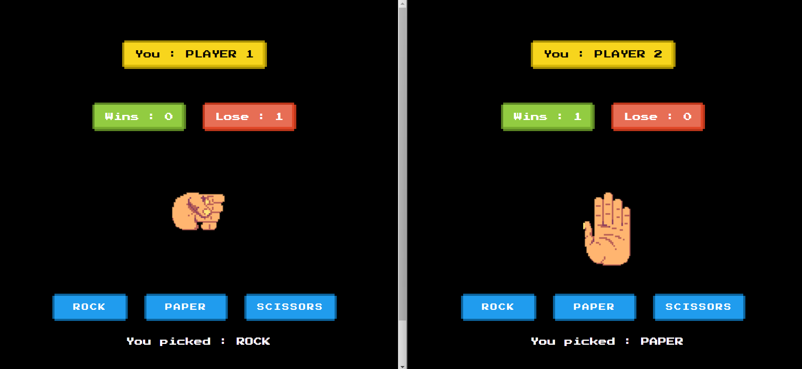

# Rock-Paper-Scissors Game

This is a simple web-based implementation of the classic game "Rock-Paper-Scissors". It allows users to play against each other in real-time over the internet.

## Table of Contents

- [Features](#features)
- [Demo](#demo)
- [Getting Started](#getting-started)
  - [Prerequisites](#prerequisites)
  - [Installation](#installation)
- [Usage](#usage)
- [Technologies Used](#technologies-used)


## Features

- Real-time multiplayer gameplay using Socket.IO for communication.
- Simple and intuitive user interface.
- Support for multiple simultaneous game sessions.
- Responsive design with multiple device support.
- Basic error handling and validation.

## Demo




## Getting Started

### Prerequisites

- Node.js installed on your machine.

### Installation

1. Clone the repository:

    ```bash
    git clone https://github.com/khuranajordan/rock-paper-scissors.git
    ```

2. Navigate into the project directory:

    ```bash
    cd rock-paper-scissors
    ```
    ```bash
    cd server
    ```

3. Install dependencies:

    ```bash
    npm install
    ```

## Usage

1. Start the server:

    ```bash
    npm start
    ```

2. Open your `client/index.html` with live server.

3. Enter your name.

4. Open the same game link in another tab/window and play with your friend.

5. Once your friend joins, both players can choose their moves (rock, paper, or scissors) and submit.

6. There will be 3 rounds and user will be redirected to the leaderboard page.

6. The winner will be displayed.

## Technologies Used

- HTML
- CSS
- JavaScript
- Node.js
- Express.js
- Socket.IO

